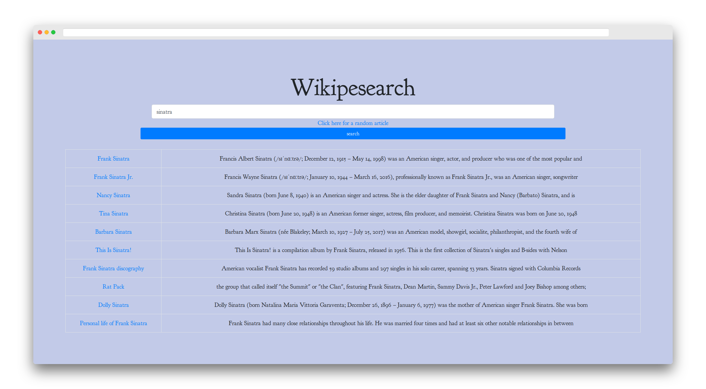

<h1 align="center">
    Wikipesearch
</h1>

    3rd project I submitted for the front-end libraries <a src="http://freecodecamp.org">FreeCodeCamp</a> course.
    

---

## Features

* Lets you type in the name of the article you want to get
* Give you different results with a short description of the article (and a clickable link for you to go straight to your article)
* Random article button : look for the unknown

---

## How does it work ?

The JS file calls Wikipedia API with the word the user types, gets a JSON in return and parses it to display the list of results

---

## Technologies used

* Only ajax